# Assets Endpoint and CI Access Tokens

## Architecture Overview

```mermaid
flowchart TD
    subgraph CIExecution [CI Execution]
        CIStart[CI Run Starts] --> GenToken[Generate Temp Token]
        GenToken --> StoreMap[Store in ciAccessTokens map]
        StoreMap --> AddToEvent[Add to ci.Event struct]
        AddToEvent --> ParseTemplate[Parse YAML with Go templates]
        ParseTemplate --> RunContainer[Run CI Container]
        RunContainer --> CIEnd[CI Run Ends]
        CIEnd --> DeleteToken[Delete Token from Map]
    end

    subgraph AssetUpload [Asset Upload Flow]
        CurlPUT[curl PUT /assets/repo/name] --> AuthMiddleware[authMiddleware]
        AuthMiddleware --> CheckTempToken{CI Token?}
        CheckTempToken -->|Yes| UseCIUser[Use CI User ID=-1]
        CheckTempToken -->|No| CheckUserToken[Check User Token]
        UseCIUser --> ValidateRepo[Validate Repo Access]
        ValidateRepo --> StoreFile[Store Asset File]
        CheckUserToken --> StoreFile
    end

    subgraph AssetRead [Asset Read Flow]
        CurlGET[GET /assets/repo/name] --> ServeFile[Serve File - Public]
    end
```




## Implementation

### 1. Temporary CI Access Tokens (`server/ci_tokens.go`)

Create a new file to manage ephemeral CI tokens:

- Thread-safe global map: `map[string]*CITokenInfo `where key is the token string and value contains `repoID int32`
- Functions: `GenerateCIToken(repoID int32) string`, `ValidateCIToken(token string, repoID int32) bool`, `RevokeCIToken(token string)`
- Use `crypto/rand` for 32-byte random tokens, base64-url encoded

### 2. Special CI User (`db/setup.go`, `db/query/query.sql`)

Create a special CI user in the database on server startup:

- User ID: `-1`
- Username: `CI`
- No personal access token (cannot be used for direct login)

Add to [`db/query/query.sql`](db/query/query.sql):

```sql
-- name: EnsureCIUser :exec
INSERT INTO users (id, username) VALUES (-1, 'CI') ON CONFLICT (id) DO NOTHING;
```

Add to [`db/setup.go`](db/setup.go) in `Setup()`:

```go
// Ensure CI user exists (used for CI token authentication)
if err := Q.EnsureCIUser(ctx); err != nil {
    return fmt.Errorf("failed to ensure CI user: %w", err)
}
```

This ensures CI tokens authenticate as a real database user without hacks or temporary users.

### 3. Integrate Temp Tokens into Auth System (`server/http.go`)

Modify `authMiddleware` to:

1. First try normal user token validation (existing behavior)
2. If that fails, check if token exists in CI tokens map
3. If CI token is valid, set context user to the special CI user (ID=-1, Username="CI")

The CI token validation also checks that the requested repo matches the token's allowed repo.This makes temp tokens work for archive URLs and any other authenticated endpoint.

### 4. Add Token to CI Event for Go Templates (`server/ci/ci.go`, `server/ci_integration.go`)

Update `ci.Event` struct in [`server/ci/ci.go`](server/ci/ci.go) to include:

```go
type Event struct {
    Rev         string  // existing
    ArchiveUrl  string  // existing
    Author      string  // existing
    Description string  // existing
    AccessToken string  // NEW - temp token for authenticated requests
    ServerUrl   string  // NEW - server URL for convenience
}
```

CI configs can then use `{{ .AccessToken }}` in templates, e.g.:

```yaml
do:
    - container:
      image: alpine
      commands:
                - curl -X PUT -H "Authorization: Bearer {{ .AccessToken }}" \
            "{{ .ServerUrl }}/assets/myrepo/release/v1.0/binary" \
            --data-binary @./build/output
```

In `executeCIForBookmarkEvent` ([`server/ci_integration.go`](server/ci_integration.go)):

- Generate temp token before executing tasks
- Populate `event.AccessToken` and `event.ServerUrl`
- For **local CI testing**: use the user's personal token instead
- Revoke token in `defer` after CI completes

### 5. Assets Storage and HTTP Endpoints (`server/assets.go`)

Create new file for asset handling:**Storage**: `data/assets/{repo_id}/{asset_name}` (asset_name can contain slashes)**Endpoints**:

- `PUT /assets/{repo_id}/{asset_name...}` - Upload asset (requires auth with repo access)
- `GET /assets/{repo_id}/{asset_name...}` - Download asset (public, no auth required)
- `GET /assets/{repo_id}/` - List assets for repo (public)
- `DELETE /assets/{repo_id}/{asset_name...}` - Delete asset (requires auth with repo access)

Register in [`server/http.go`](server/http.go):

```go
s.httpMux.HandleFunc("/assets/", authMiddleware(handleAssets))
```


### 6. CLI `assets` Command (`cmd/assets.go`)

Create new command file following the pattern in [`cmd/secrets.go`](cmd/secrets.go):

- `pogo assets list` - List all assets for current repo
- `pogo assets get <name>` - Download asset to stdout
- `pogo assets put <name> [file]` - Upload asset from stdin or file path
- `pogo assets rm <name>` - Delete an asset

The CLI will use HTTP requests directly (not gRPC) since assets are HTTP-based.

### 7. Client HTTP Methods (`client/assets.go`)

Add HTTP helper methods to the client:

- `ListAssets() ([]string, error)`
- `GetAsset(name string, writer io.Writer) error`
- `PutAsset(name string, reader io.Reader) error`