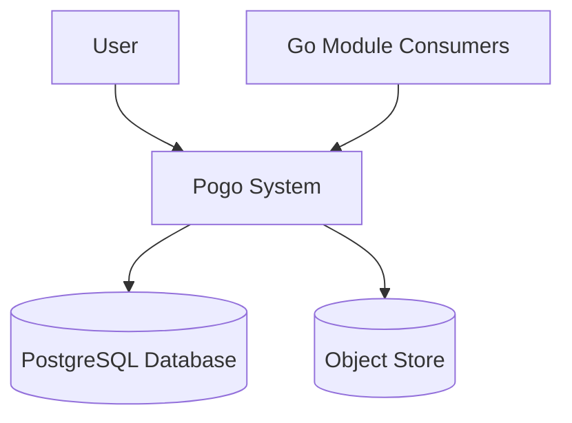
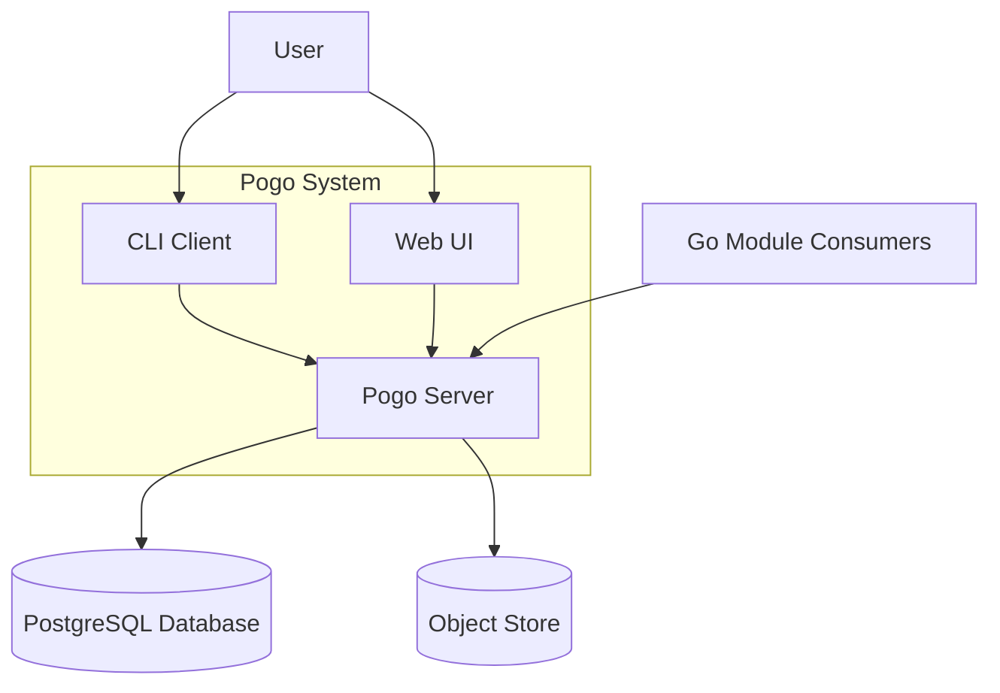
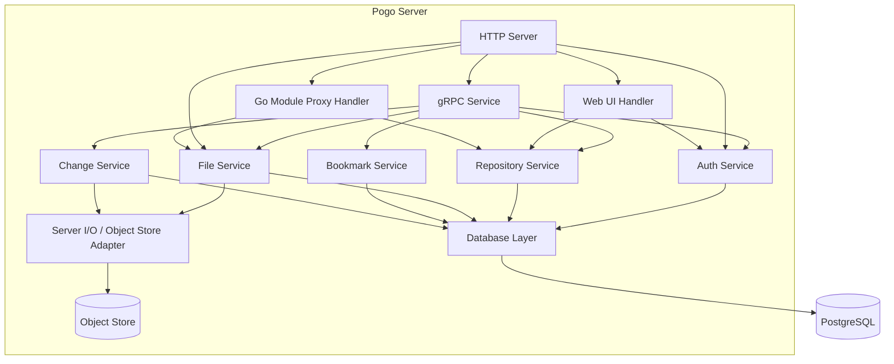
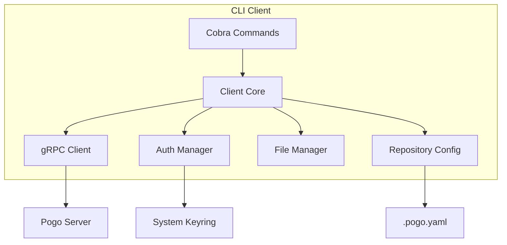
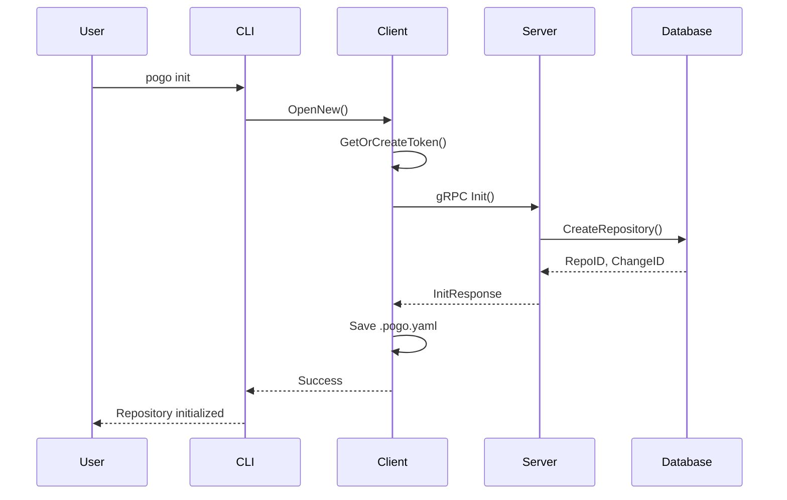
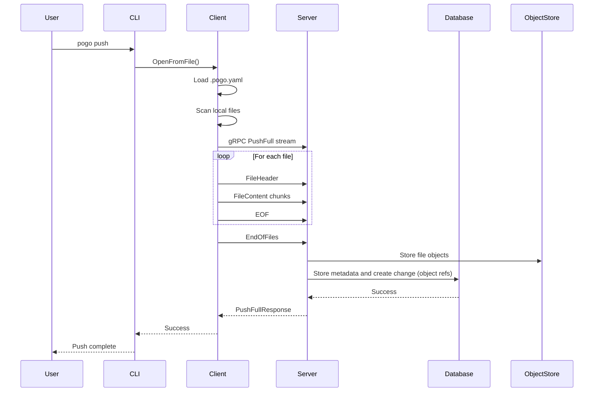
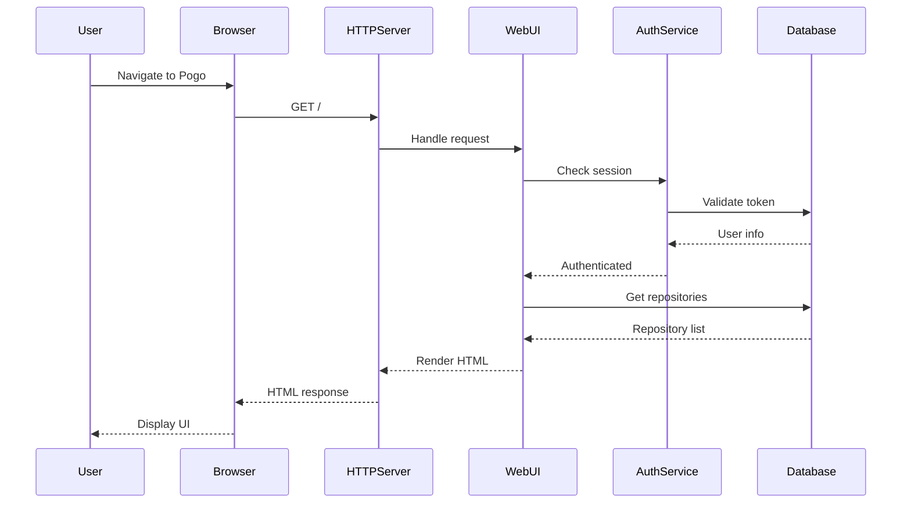

# Pogo Architecture

## Overview

Pogo is a centralized version control system that provides a single source of truth for version control with support for multiple file types, conflict resolution, and Go module compatibility.

Pogo stores metadata (repositories, changes, bookmarks, references) in PostgreSQL and stores file contents (blobs/objects) in a filesystem-backed object store. The object store is treated as the canonical storage for file contents; the database stores metadata and references to the objects.

## C4 Diagrams

### Level 1: System Context

### Level 2: Container Diagram

### Level 3: Component Diagram - Server

### Level 3: Component Diagram - CLI Client

### Level 4: Code Organization

```mermaid
graph TB
    subgraph "Package Structure"
        Main[main.go]

        subgraph "cmd/"
            rootCmd[root.go]
            ServeCmd[serve.go]
            InitCmd[init.go]
            PushCmd[push.go]
            EditCmd[edit.go]
            LogCmd[log.go]
            BookmarkCmd[bookmark.go]
            DescribeCmd[describe.go]
            InfoCmd[info.go]
            NewCmd[new.go]
            RmCmd[rm.go]
            TokenCmd[token.go]
            WhoamiCmd[whoami.go]
        end

        subgraph "client/"
            Client[client.go]
            ClientGrpc[grpc.go]
            ClientFiles[files.go]
            ClientRepo[repo.go]
            ClientToken[token.go]
            ClientIO[io.go]
        end

        subgraph "server/"
            Server[server.go]
            ServerGrpc[grpc.go]
            ServerHttp[http.go]
            ServerAuth[auth.go]
            ServerFiles[files.go]
            ServerRepo[repo.go]
            ServerIO[io.go]
            GoProxy[goproxy.go]
        end

        subgraph "db/"
            Database[db.go]
            Migrations[migrations/]
            Queries[query/]
            DbSetup[setup.go]
            DbMigrate[migrate.go]
        end

        subgraph "protos/"
            ProtoDef[messages.proto]
        end

        subgraph "filecontents/"
            FileDetection[detections.go]
            FileContents[filecontents.go]
        end

        subgraph "auth/"
            Auth[auth.go]
        end

        subgraph "colors/"
            Colors[ansi.go]
        end

        subgraph "ptr/"
            Ptr[ptr.go]
        end

        subgraph "tty/"
            TTY[tty.go]
        end

        subgraph "editor/"
            Editor[editor.go]
        end

        subgraph "compressions/"
            CompressCgo[compressions_cgo.go]
            CompressGo[compressions_go.go]
        end

        subgraph "runedrawer/"
            RuneDrawer[runedrawer.go]
        end

        subgraph "server/webui/"
            WebComponents[components/]
            WebTemplates[*.templ]
            WebRenderer[renderer.go]
            WebUtils[utils.go]
        end

        subgraph "server/public/"
            PublicFiles[public.go]
        end
    end

    Main --> rootCmd
    rootCmd --> ServeCmd
    rootCmd --> InitCmd
    rootCmd --> PushCmd
    rootCmd --> EditCmd
    rootCmd --> LogCmd
    rootCmd --> BookmarkCmd
    rootCmd --> DescribeCmd
    rootCmd --> InfoCmd
    rootCmd --> NewCmd
    rootCmd --> RmCmd
    rootCmd --> TokenCmd
    rootCmd --> WhoamiCmd

    ServeCmd --> Server
    ServeCmd --> Database
    InitCmd --> Client
    PushCmd --> Client
    EditCmd --> Client
    LogCmd --> Client
    LogCmd --> TTY
    LogCmd --> BubbleTea
    BookmarkCmd --> Client
    DescribeCmd --> Client
    DescribeCmd --> Editor
    InfoCmd --> Client
    InfoCmd --> Colors
    InfoCmd --> Ptr
    NewCmd --> Client
    RmCmd --> Client
    TokenCmd --> Client
    WhoamiCmd --> Client

    Client --> ClientGrpc
    Client --> ClientFiles
    Client --> ClientRepo
    Client --> ClientToken
    Client --> ClientIO
    Client --> ProtoDef
    ClientToken --> TTY
    ClientFiles --> Ptr

    Server --> ServerGrpc
    Server --> ServerHttp
    Server --> ProtoDef
    ServerGrpc --> Database
    ServerGrpc --> FileContents
    ServerGrpc --> Colors
    ServerGrpc --> RuneDrawer
    ServerHttp --> Auth
    ServerHttp --> Database
    ServerHttp --> FileContents
    ServerHttp --> PublicFiles
    ServerHttp --> WebRenderer
    ServerHttp --> GoProxy
    ServerFiles --> Database
    ServerFiles --> FileContents
    GoProxy --> Database
    GoProxy --> FileContents

    ServerIO --> ObjectStore
    ServerFiles --> ServerIO
    ChangeService --> ServerIO

    Auth --> Database
    Editor --> TTY

    WebUtils --> Auth
    WebUtils --> Database
```

## Data Flow

### Repository Initialization

### Push Operation

Notes:

- File contents are written to the object store (filesystem) as immutable blobs.
- The database stores metadata and references (object IDs / paths / hashes) to those blobs; metadata updates are transactional.

### Web UI Access

## Key Design Patterns

### 1. Unified Server Architecture

- Single binary serves both gRPC (for CLI) and HTTP (for Web UI)
- HTTP/2 with h2c for protocol detection
- Shared business logic between interfaces

### 2. Stream-Based File Transfer

- gRPC streaming for efficient large file handling
- Chunked transfer with headers and content separation
- Support for multiple file encodings (UTF-8, UTF-16, UTF-32)

### 3. Token-Based Authentication

- Personal access tokens stored locally
- Automatic token creation and management
- Shared authentication between CLI and Web UI

### 4. Change-Based Version Control

- Each push creates a new change with unique ID
- Bookmarks point to specific changes
- Support for multiple parents (merge) and children (branch)

### 5. Hybrid Storage (Database + Object Store)

- PostgreSQL stores metadata, relationships, and indexes for queries
- Files (content blobs) are stored in a filesystem-backed object store (immutable objects)
- Metadata references objects by ID/path/hash; the DB and object store together represent the full repository state

### 6. Transactional Consistency

- Metadata updates happen in transactions in PostgreSQL
- Object writes are done before committing metadata that references them; if object writes fail, the DB transaction is not committed

### 7. Object Store & Garbage Collection

- Garbage collection removes unreferenced objects from the object store and corresponding DB records
- Adaptive GC strategy:
  - Small-scale (< 10 million files): in-memory hash set for fast lookups
  - Large-scale (>= 10 million files): batched processing with constant memory usage
- GC can be run manually (`pogo gc`) or as a scheduled background task when the server runs
- The threshold and GC parameters are configurable via environment variables (e.g. `GC_MEMORY_THRESHOLD`)

### 8. Interactive Terminal UI

- BubbleTea-based log viewer for scrollable output
- Automatically activated when log output exceeds terminal height
- Can be disabled with `--no-pager` flag
- Keyboard navigation (arrows, page up/down, home/end)

## Technology Stack

- **Language**: Go
- **CLI Framework**: Cobra
- **RPC**: gRPC with Protocol Buffers
- **Database**: PostgreSQL with sqlc
- **Object Store**: Local filesystem (configurable path); stores immutable blobs (can be swapped for other backends in future)
- **Web UI**: Templ templates
- **HTTP Server**: net/http with HTTP/2 support
- **Build Tool**: Just
- **TUI Components**: Charm BubbleTea for interactive terminal UI (log viewer)
